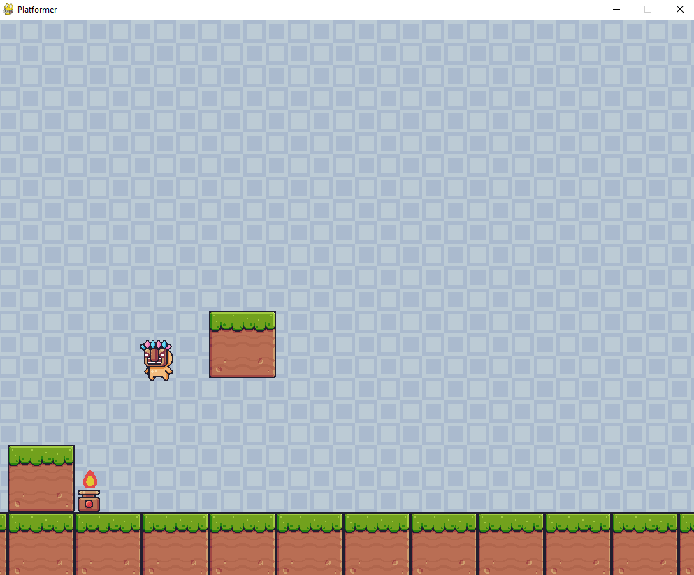

# platformer_game
Brushing up on Python by following a tutorial: https://www.youtube.com/watch?v=6gLeplbqtqg

## Setup pygame in a python venv environment ⚙
```shell
    ## Setup on Windows
    # Windows
    python -m venv myenv
    ## Activate
    # cmd
    myenv\Scripts\activate
    # or PowerShell
    .\myenv\Scripts\Activate.ps1
    
    ## Setup on *nix
    python3 -m venv myenv
    ## Activate
    source myenv/bin/activate

    pip install pygame
```
- The project can be expanded upon, and the code can (must) be cleaned =)


